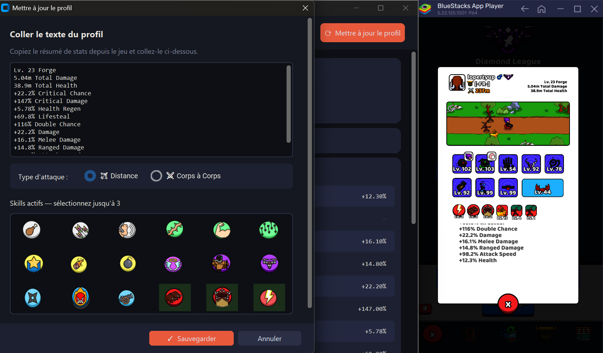
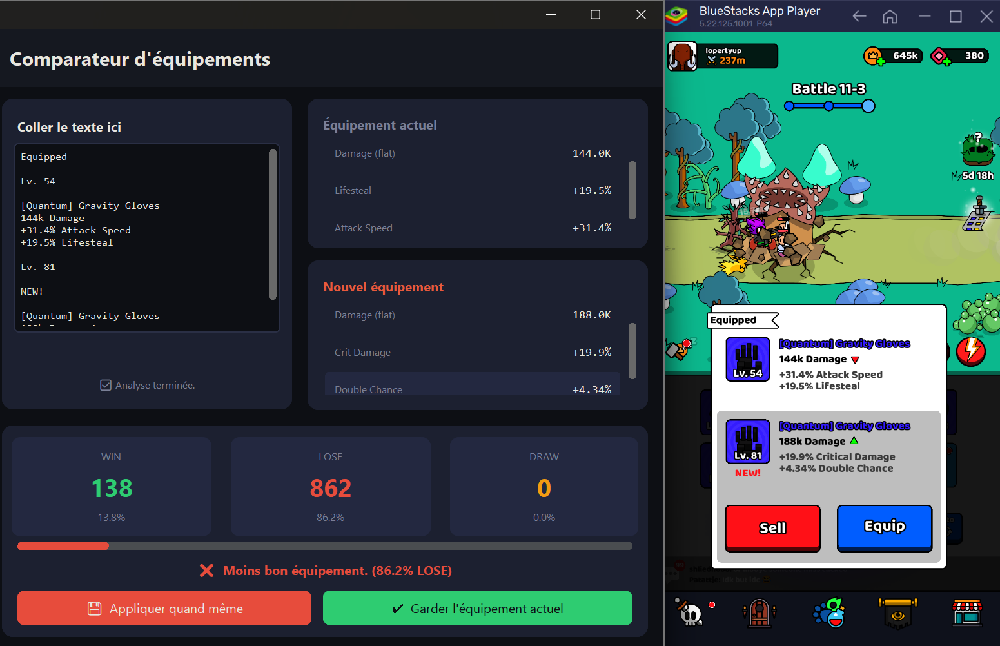
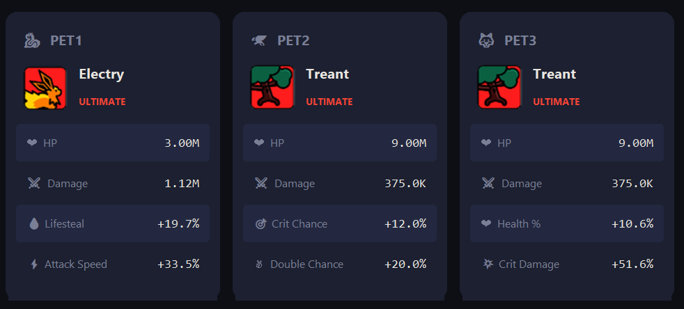
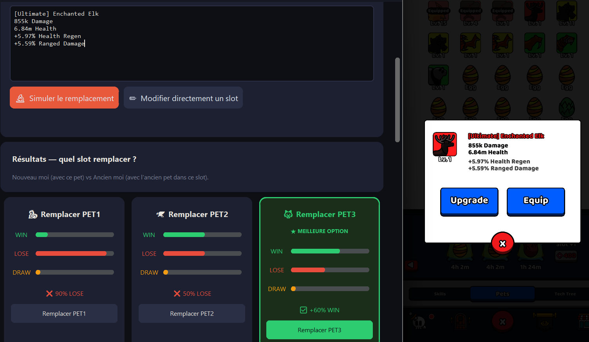
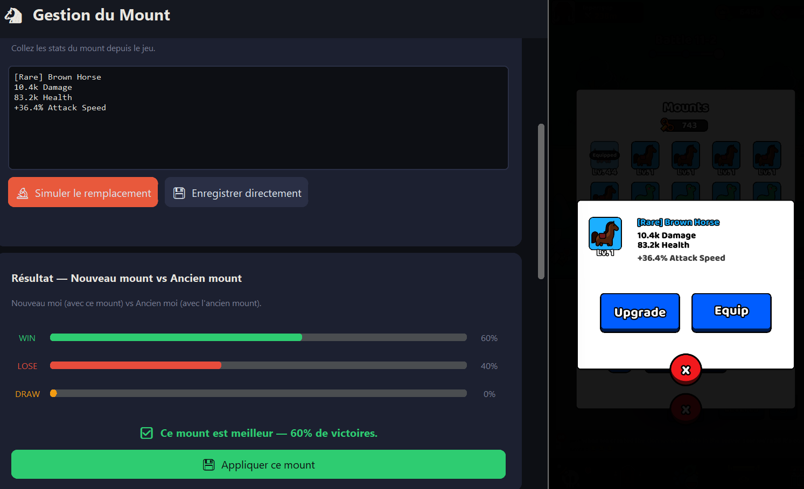

# ⚔️ Forge Master UI

Analysis and simulation tool for the mobile game **Forge Master**.
It reads your stats directly off the BlueStacks window with built-in
OCR, predicts win/loss outcomes against any opponent, compares new
equipment instantly, and finds the best distribution of your substat
points — all running locally on your PC.

---

## 📋 Features

- **Built-in OCR** — one click captures your profile, opponent, equipment,
  pets, mount or skill straight from BlueStacks. No need to copy-paste text.
- **Combat Simulator** — 1000 fights per click, returns your win rate.
- **Equipment Comparator** — auto-simulates "keep vs. swap" for every drop.
- **Substat Optimizer** — genetic search over thousands of substat builds.
- **Pets, Mounts and Skills management** — library-backed, always compared
  at level 1 for a fair match-up.

---

## 🛠️ Installation

### 1. Install BlueStacks and Forge Master

Forge Master is a mobile game. To play it on PC you need **BlueStacks**
(Android emulator).

👉 Download BlueStacks: https://www.bluestacks.com/index.html

Launch BlueStacks, sign in to the Google Play Store and install
**Forge Master**.

> 💡 The UI assumes a 1920×1080 screen with BlueStacks anchored to the
> right side (570 px wide). Move/resize BlueStacks accordingly, or
> re-trace the capture zones from the **Zones** tab once the app is open.

---

### 2. Download the code

On the GitHub project page, click the green **Code** button then
**Download ZIP**. Extract the folder wherever you want on your PC.

---

### 3. Install Python

👉 Download Python: https://www.python.org/downloads/

> ⚠️ **Important**: during installation, check **"Add Python to PATH"**
> before clicking Install.

---

### 4. Install dependencies

Open a terminal in the project folder (right-click in the folder →
**Open in Terminal** on Windows), then run:

```
pip install customtkinter pillow rapidocr_onnxruntime
```

What each package does:

- `customtkinter` — modern look-and-feel for the desktop UI.
- `pillow` — screen capture + image pre-processing.
- `rapidocr_onnxruntime` — the OCR engine. Ships the PP-OCR model as a
  lightweight ONNX runtime (~20 MB, pure CPU, no GPU needed).

> 💡 **Alternative OCR backend.** If `rapidocr_onnxruntime` doesn't
> install on your system, you can use the heavier `paddleocr` fallback
> instead: `pip install paddleocr paddlepaddle`. The app auto-detects
> whichever is available.

If `pip install` complains about "externally-managed environment", add
`--break-system-packages` at the end.

---

### 5. Launch the application

From the same terminal:

```
python main.py
```

The application opens. 🎉

---

## 🔭 Calibrating the capture zones

The OCR needs to know **where on your screen** each kind of panel lives
in BlueStacks. This is a one-time setup (stored in `backend/zones.json`).

1. In the app, open the **📐 Zones** tab.
2. The table lists eight zones:

   | Zone              | What to trace                                                |
   | :---------------- | :----------------------------------------------------------- |
   | Profile           | Your own stat panel (scrollable)                             |
   | Opponent          | The opponent's stat panel (also scrollable)                  |
   | Equipment         | The equipment comparison popup (with NEW!)                   |
   | Skill             | A skill's description panel                                  |
   | Pet               | The active pet's stat panel                                  |
   | Mount             | The mount's stat panel                                       |
   | Player weapon     | A tight box around YOUR equipped weapon icon                 |
   | Player build      | YOUR full character/equipment panel (same framing as Opponent) |

3. Click **Set zone** on a row. The Forge Master window stays where it
   is, and a translucent red overlay covers only BlueStacks.
4. Drag a rectangle around the panel. Release the mouse to save, or
   press **Esc** to cancel.
5. Some zones (profile, opponent) ask for **two captures** — the panels
   scroll, so you capture once at the top and once after scrolling.
   Just follow the on-screen hint between each drag.

> 💡 **Player weapon vs Player build.** The two new zones serve
> different needs. *Player weapon* is a single icon used by the
> Simulator to feed the exact wind-up / recovery / projectile
> travel time of your weapon into the fight model. *Player build*
> captures all 8 equipped pieces at once and persists them to
> `equipment.txt` — that's what the Build view shows and what the
> Equipment Comparator reads when you pick a slot in its
> "Compare against" dropdown.

Once a zone is green, you can forget about it — a single click on the
**📷 Scan** button of any tab will replay that exact capture.

---

## 🎮 Using the tool

Every scan button follows the same pattern:

1. In BlueStacks, open the matching screen in Forge Master.
2. In the Forge Master UI tab, click **📷 Scan**.
3. Under the hood: the zone is captured → the image is passed through a
   color-normalization pre-processor → OCR runs → the text is parsed →
   the form is filled in automatically.
4. Tweak the parsed values by hand if something looks off, then save.

### Dashboard — your profile

Open your character profile in the game, click **📷 Scan** on the
**Dashboard** tab's "Update profile" dialog, and the full stat block is
extracted:

```
Lv. 23 Forge
5.04m Total Damage
38.9m Total Health
+22.2% Critical Chance
+147% Critical Damage
+5.78% Health Regen
+69.8% Lifesteal
+116% Double Chance
+22.2% Damage
+16.1% Melee Damage
+14.8% Ranged Damage
+98.2% Attack Speed
+12.3% Health
```



### Equipment Comparator

In the game, tap a new equipment drop so the side-by-side popup
(Equipped vs. NEW!) shows up. On the **Equipment** tab, click **📷 Scan**.

```
Equipped
Lv. 54
[Quantum] Gravity Gloves
144k Damage
+31.4% Attack Speed
+19.5% Lifesteal
4
Lv. 81
NEW!
[Quantum] Gravity Gloves
188k Damage
+19.9% Critical Damage
+4.34% Double Chance
```

The UI runs the simulation immediately and tells you whether the new
piece is an upgrade.

> ⚠️ The screenshot **must contain the NEW! tag** — that's how the tool
> knows which of the two items is the candidate.



#### Compare against a saved slot (no NEW! popup needed)

Once you've captured your full build via the **Player build** zone (see
the new **Build** tab below), you can compare a single new item against
the piece equipped in any slot — no need for the side-by-side NEW!
popup anymore.

1. Pick a slot in the **Compare against** dropdown (Helmet, Body, …).
2. Paste **only the new item's text** (one `[Rarity] Name` block) into
   the textbox, or scan it.
3. Simulation runs against the equipped piece pulled from
   `equipment.txt`.

> 💡 **Limitation.** Per-piece substats are not yet tracked. In this
> single-item flow, only the flat HP / damage swap is folded into the
> simulation; substats stay at your current totals. The headline
> verdict (better / worse) is still meaningful — substat deltas just
> aren't visualised.

### Build (your 8 equipped pieces)

The **Build** tab shows your eight equipped pieces in a 4 × 2 grid
with the icon, name, level, and main stat (HP or Damage) of each
slot. Click **📷 Scan Build** to re-capture the whole panel; the
**Player build** zone you calibrated in the Zones tab is replayed,
each icon is template-matched against the in-game library, levels
are OCR'd, and the result is persisted into
`backend/equipment.txt`.

Why it matters:
- The PvP HP pool is now computed per source (1 × equipment, 0.5 × pets,
  0.5 × skill passives, 2 × mount). Knowing your equipment HP
  precisely lets the simulator apply the right multiplier.
- The Equipment Comparator reads from this Build so you can compare
  against the equipped piece without re-capturing it every time.

### Pets

In the game, open the pet's page. On the **Pets** tab in the UI, click
**📷 Scan**:

```
Lv.1
[Ultimate] Enchanted Elk
855k Damage
6.84m Health
+5.97% Health Regen
+5.59% Ranged Damage
```



> 💡 **Everything is compared at level 1.** Main stats (Damage, Health)
> scale with level but substats (percentages) don't — so the app
> internally normalizes to level 1 using a built-in library of base
> stats. Two pets of different levels get a fair head-to-head.



### Mount

Same flow as pets — on the **Mount** tab, click **📷 Scan**:

```
Lv.1
[Rare] Brown Horse
10.4k Damage
83.2k Health
+6.95% Health
```



### Skills

On the **Skills** tab, click **📷 Scan** while a skill's description
panel is open in the game. The parser fills in the skill name, rarity,
level, damage/hits/cooldown and buff fields automatically. The always-on
**passive** portion (passive damage, passive HP) feeds directly into the
character profile; the **active** portion is consumed at fight time by
the simulator.

### Combat Simulator

1. Open the **Simulator** tab.
2. (Optional, recommended) On the player panel, click **📷 Scan
   weapon** with your equipped weapon icon visible in BlueStacks
   (calibrated via the **Player weapon** zone). The simulator picks
   up the wind-up / recovery / projectile travel time of your
   weapon for the next fight; without this, it falls back to a
   generic 0.25 s per swing.
3. Click **📷 Scan** with the opponent's profile visible in BlueStacks
   (don't forget their skills — use the Skills scan for each one), or
   key in the stats by hand.
4. Click **Simulate** — 1000 fights are played, and the tool reports
   your win / loss / draw rate.

### Substat Optimizer

1. Open the **Optimizer** tab.
2. Choose the number of generations and simulations per candidate.
3. Click **Launch**. A genetic algorithm explores thousands of substat
   distributions.
4. Results:
   - The substats that matter most for your current build.
   - The best build found vs. your current one.
   - Concrete re-allocation suggestions.

---

## 🧠 How the OCR handles coloured labels

Forge Master uses a *lot* of coloured text — the rarity bracket and
epoch bracket on every piece of equipment, pet, mount and skill. Each
colour also carries a dark anti-aliased halo that trips up generic OCR.

The app ships a pre-processor, `backend/fix_ocr.recolour_ui_labels`,
that knows the exact palette:

| Colour | Hex       | Used for           |
| :----- | :-------- | :----------------- |
| red    | `#FF1C1C` | Space epoch        |
| cyan   | `#1CAFFF` | Medieval epoch     |
| green  | `#1CFF41` | Early-Modern epoch |
| yellow | `#F8FF1C` | Modern epoch       |
| purple | `#AA1CFF` | Interstellar epoch |
| teal   | `#2DFFDA` | Multiverse epoch   |
| brown  | `#6F3031` | Underworld epoch   |
| orange | `#FF5701` | Divine epoch       |

Every pixel matching any of these colours (or a halo pixel blended with
a dark background) is repainted a uniform dark blue before OCR. Result:
PaddleOCR reads bracket labels with the same contrast regardless of
rarity. If you add a new epoch with a new colour, just extend
`UI_LABEL_COLORS` in `backend/fix_ocr.py` and you're done.

A second safety net — **fuzzy bracket matching** — handles the residual
OCR typos. When the parser sees something like `[Quanturm]`, it uses
`difflib.get_close_matches` against the known rarity/epoch vocabulary
and corrects it back to `[Quantum]`.

---

## 📂 Project layout

```
forge_master_UI/
├─ main.py                    Entry point
├─ game_controller.py         Thin facade between UI and backend
├─ ui/
│  ├─ app.py                  Main window + side navigation
│  ├─ theme.py                Colours & fonts
│  ├─ widgets.py              Reusable scan buttons, status labels, etc.
│  ├─ zone_picker.py          Fullscreen overlay for zone calibration
│  └─ views/                  One file per tab (dashboard, equipment, ...)
└─ backend/
   ├─ ocr.py                  PaddleOCR / RapidOCR wrapper + screen capture
   ├─ fix_ocr.py              Image pre-processor + text normalizer
   ├─ parser.py               Raw OCR text → structured dicts
   ├─ stats.py                Pure stat math (applying gear, companions, …)
   ├─ simulation.py           Fight engine (1v1 deterministic + batches)
   ├─ optimizer.py            Genetic substat search
   ├─ persistence.py          Read / write profile.txt, pets.txt, …
   ├─ zone_store.py           Read / write zones.json
   ├─ constants.py            All the magic numbers and stat keys
   ├─ zones.json              Capture rectangles (one-time calibration)
   └─ *.txt                   Your saved profile, pets, mount, skills, libraries
```

Everything runs locally. No data is sent anywhere.

---

## ❓ Common issues

**`python` is not recognized in the terminal**
→ Reinstall Python with **"Add Python to PATH"** checked.

**`pip install` fails with an "externally-managed environment" error**
→ Re-run with `--break-system-packages` at the end.

**The app starts but "📷 Scan" says `OCR unavailable`**
→ The OCR backend isn't installed. Run:
`pip install rapidocr_onnxruntime`
(or fall back to `pip install paddleocr paddlepaddle`).

**Scan says `Zone not configured`**
→ Open the **Zones** tab and trace the matching rectangle.

**Scan works, but parses nothing (`OCR found nothing`)**
→ The capture zone is probably off. Re-trace it in the **Zones** tab.
Make sure the game panel is fully in-frame when you click Scan.

**A bracket label is read wrong (e.g. `[Quartum]` instead of `[Quantum]`)**
→ The fuzzy matcher usually catches this. If not, just edit the field by
hand — your change persists.

**The window opens but geometry looks weird**
→ The UI assumes 1920×1080. Resize the main window once; its geometry
is remembered in `backend/window.json`.

---

## 📌 Notes

- Runs entirely locally — no network access after `pip install`.
- The simulator's accuracy depends on the accuracy of the stats you feed
  it. Using the integrated OCR is usually more reliable than typing by
  hand, provided the zones are calibrated correctly.
- The optimizer can take a few minutes depending on the generations /
  simulations you pick.

---

*Open source project — contributions welcome!*
